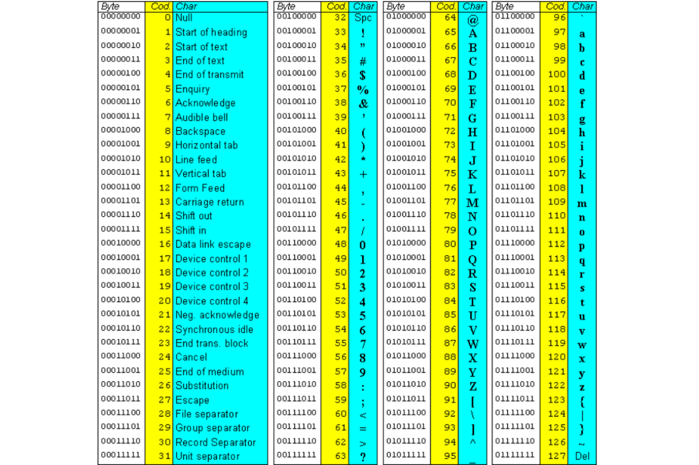

# Guida alla programmazione in C++

## Questa guida è per C++ dalla versione C++11 in poi utilizzando come IDE Visual Studio 2022 e come compilatore MSVC (il compilatore di Visual Studio)

---

## __Livello Principiante__

---

### I commenti

I commenti sono delle parti di testo inserite nel codice il cui unico scopo è quello di fornire informazioni sul codice, vengono ignorati dal compilatore e perciò non influiscono sull'esecuzione del programma.

Per scrivere un commento si può precedere la frase dal simbolo // oppure racchiudere la frase tra \\\* e \*\\.

Esempio:

```cpp
// questo è un commento su una riga
/*
    questo è un commento
    su più righe
*/
/* questo è un altro commento */
```

---
---

### Le basi del linguaggio C++

#### ___Hello World___

Ecco un semplice programma che scrive “Hello World!”:

```cpp
#include <iostream>

int main()
{
    std::cout << "Hello, World!";

    return 0;
}
```

#### ___Spiegazione___

__iostream__ (input output stream) è un file esterno, che è necessario includere per usare __cout__.

__main__ rappresenta il programma, e contiene ciò che deve essere eseguito, __int__ segnala che il tipo restituito dalla funzione è un numero intero.

__return 0__ termina il programma con codice 0 che significa che non si sono verificati errori

__std__ è uno spazio di nomi che contiene l'oggetto __cout__, si scrive __std::__ prima di cout per indicare che cout appartiene allo spazio di nomi std (standard).

__std::cout__ è utilizzato per scrivere nella console, in questo caso “Hello, World!”, le cose da scrivere sono concatenate con l'operatore <<.

Il punto e virgola dopo "Hello, World!" indica che l'istruzione è terminata, infatti il compilatore distingue le istruzioni grazie al punto e virgola e non al carattere di nuova linea.

'#include \<iostream\>' non ha un punto e virgola alla fine perché è una direttiva, si possono riconoscere le direttive perché iniziano con '#'

___using namespace std___

Esiste un modo per evitare di scrivere 'std::' prima di ogni funzione\oggetto\classe\struttura dello spazio di nomi standard:

```cpp
using namespace std;
```

In questo caso il programma diventa

```cpp
#include <iostream>
using namespace std;
int main()

{
    cout << "Hello, World!";
    return 0;
}
```

In questa guida non useremo 'using namespace std' perché così è più chiaro

un'alternativa preferibile a using namespace std potrebbe essere questa

```cpp
using std::cout;
```

oppure

```cpp
using std::cout, std::cin;
```

chiaramente scrivendo ciò la regola vale SOLO per gli oggetti\funzioni\strutture\classi riportati dopo __using__

---
---

### L'output (o stampa a video)

In C++ esistono quattro oggetti principali per eseguire l'output:
__cout__, __cerr__, __wcout__, __wcerr__.  
(cout = c output, cerr = c error, wcout = wide c output, wcerr = wide c error)

cout e wcout sono usati per l'output normale mentre cerr e wcerr sono usati per i messaggi di errore,

cout e cerr sono usati con le stringhe normali e wcout e wcerr con stringhe larghe,
vale a dire stringhe che supporatano una maggiore quantità di caratteri (come ad esempio lettere accentate).

Esempio:

```cpp
#include <iostream>
int main()
{
    std::cout <<  "questa e' una stringa normale"        << std::endl;
    std::cerr <<  "questa e' una stringa di errore"      << std::endl;

    setlocale(0, "");

    std::wcout << L"questa è una stringa wide"           << std::endl;
    std::wcerr << L"questa è una stringa wide di errore" << std::endl;

    return 0;
}
```

Notare l'aggiunta di 'L' prima delle stringhe wide, in generale bisogna aggiungere __'setlocale(0, "");'__ solo una volta prima di usare stringhe wide, ed è buona pratica non mescolare cout con wcout o cerr con wcerr.

__std::endl__ (end of line) serve per andare a capo.

---
---

### Le sequenze di escape

Le sequenze di escape rappresentano dei caratteri speciali non stampabili:

+ __\\n__ = aggiunge una nuova riga (va a capo)
+ \\r = sposta il cursore all'inizio della riga
+ \\b = carattere backspace
+ \\a = suono di errore
+ \\t = tab
+ \\\\ = carattere backslash
+ \\" = virgolette (per distinguerle da quelle che delimitano la stringa)
+ \\' = apice (viene è usato per delimitare un singolo carattere invece di una stringa)
+ \\0 = carattere nullo (non uno spazio)

Ha particolare importanza \\n, che è un'alternativa in genere preferibile a std::endl

---
---

### La tabella ASCII

La tabella ASCII assegna un numero a ogni carattere:



---
---

### I datatype

I datatype sono i tipi tra cui bisogna scegliere quando si dichiara una variabile, esistono dei datatype primari, forniti dal linguaggio C++, e datatype secondari che possono essere definiti nei file header esterni oppure direttamente nel codice.

#### ___I datatype primari___

Tipi interi:

+ __short__: un intero compreso tra -32.768 e 32.767
+ __int__: un intero compreso tra -2.147.483.648 e 2.147.483.647
+ __long__ (o __int32): a seconda del sistema può comportarsi come int o long long
+ __long long__ (o __int64): un intero compreso tra -2^63 e 2^63 - 1

Tipi decimali:

+ __float__: un numero decimale con precisione di 6 o 7 cifre decimali
+ __double__: un numero decimale con precisione di 15-16 cifre decimali
+ __long double__: varia, ma in genere ha una precisione decimale di 18-19 cifre

Altro:

+ __char__: un carattere
+ __bool__: può essere solo vero (true o 1) oppure falso (false o 0)

E' possibile aggiungere la parola chiave __unsigned__ prima del tipo, in questo modo il datatype non potrà mai contenere valori negativi, ma può contenere valori positivi con un range doppio

Esempio:

__int64 va da __-9.223.372.036.854.775.808__ a __9.223.372.036.854.775.807__,  
ma unsigned__int64 va da __0__ a __18.446.744.073.709.551.615__.

#### ___I typedef___

Per definire un datatype secondario è possibile utilizzare un typedef:  
__typedef _\<datatype\>_ _\<nome\>_;__

Esempio:

```cpp
typedef unsigned long long size_t;
```

Qui si definisce __size_t__ come 'unsigned long long'.

Esiste un altro modo per definire un datatype secondario con la parola chiave __using__:  
__using _\<nome\>_ = _\<datatype\>_;__

L'esempio di prima diventa

```cpp
using size_t = unsigned long long;
```

---
---

### Le variabili e le costanti

#### ___Che cosa sono___

In C++ le variabili vengono dichiarate con questa sintassi:  
___\<datatype\>_ _\<nome\>_;__

In questo modo si dichiara una variabile che però non ha un valore, che si può assegnare con l'inizializzazione:  
___\<datatype\>_ _\<nome\>_ = _\<espressione\>_;__

Per dichiarare una costante bisogna aggiungere la parola chiave __const__ all'inizio ed è obbligatorio assegnare un valore:  
__const _\<datatype\>_ _\<nome\>_ = _\<espressione\>_;__

Le variabili possono cambiare il loro valore durante l'esecuzione del programma, al contrario delle constanti.

#### ___L'inizializzazione___

Si può usare la parola chiave __auto__ al posto del datatype, dove il compilatore proverà a dedurre il tipo dall'espressione, perciò è obbligatorio assegnare un valore, ad esempio è errato scrivere

```cpp
auto Variable;
const double Pi;
```

Ma è corretto scrivere

```cpp
auto Variable = 1;
const double Pi = 3.1415926535;
int NewVariable = Variable;
long lines;
```

Se due o più variabili sono dichiarate con lo stesso datatype si può usare una virgola per separarle e scrivere una sola volta il datatype:

```cpp
int A = 1, B = 2, _i, __i;
```

Esistono altri due modi per inizializzare le variabili, l'inizializzazione per copia e uniforme, ma il datatype dell'espressione deve essere uguale a quello della variabile:  

Inizializzazione per copia  

```cpp
int A(1), B(2);
```

Inizializzazione uniforme

```cpp
int A{ 1 }, B{ 2 };
```

Nell'inizializzazione uniforme si può omettere il valore tra le parentesi:

```cpp
int x{}; // stessa cosa di int x{ 0 };
```

#### ___Cambiare il valore___

Per cambiare il valore di una variabile si può usare l'operatore __=__.  
Esempio:

```cpp
x = 1; // vuol dire "x è impostato a 1" non "x è uguale a 1"
```

Vediamo come è possibile scambiare il valore di due variabili:

```cpp
int main()
{
    int x = 5, y = 10;

    auto temp = x; // x = 5   y = 10  temp = 5
    x = y;         // x = 10  y = 10  temp = 5
    y = temp;      // x = 10  y = 5   temp = 5

    // x = 10   y = 5

    return 0;
}
```

---
---

### L'input utente

In C++ l'input viene eseguito con __std::cin__, necessario includere  __\<iostream\>__:

```cpp
#include <iostream>

int main()
{
    int Number1, Number2;
    std::cin >> Number1 >> Number2;
}
```

In questo modo l'utente inserisce da console due valori per le variabili Number1 e Number2, tuttavia l'input si blocca se l'utente inserisce dei caratteri non numerici ma vedremo in seguito come risolvere questo problema.

E' buona pratica inserire sempre un output prima di ogni input per far capire all'utente cosa deve fare:

```cpp
#include <iostream>

int main()
{
    int Number1;
    std::cout << "inserisci un numero\n";
    std::cin >> Number1;
    std::cout << "hai inserito: " << Number1;
    return 0;
}
```

---
---

### L'ambito delle variabili

In C++ una variabile viene creata con una dichiarazione e distrutta quando esce dal proprio ambito, che è definito dalle parentesi graffe, una variabile dichiarata fuori da una funzione si dice __globale__ mentre una variabile dichiarata in una funzione si dice __locale__.

Se due variabili, una locale e una globale hanno lo stesso nome ma ambiti diversi, è possibile utilizzare l'__operatore di risoluzione dell'ambito ::__ per accedere a quella globale, ciò funziona anche con le funzioni, o con una funzione e una variabile:

```cpp
#include <iostream>
const double Variable = 10.2; // variabile globale

int main()
{
    int Variable = 7;
    std::cout << Variable << '\n'; // output = 7
    std::cout << ::Variable << '\n'; // output = 10.2

    return 0;
}
```

In questo caso abbiamo due variabili con lo stesso nome, una locale e una globale, possiamo accedere a quella locale con 'variable' e a quella globale con '::variable'.

Due variabili non possono avere lo stesso nome all'interno dello stesso ambito.

---
---

### Gli operatori matematici

In C++ ci sono 5 operatori matematici __primari (+, -, \*, /, %)__, 5 operatori matematici __composti (+=, -=, \*=, /=, %=)__ e 2 operatori __unari (++ e --)__.

#### ___Gli operatori matematici primari___

Gli operatori __(+, -, \*, /)__ indicano rispettivamente addizione, sottrazione, moltiplicazione e divisione.  
L'operatore __%__ indica il resto della divisione intera.

Gli operatori __\* /__ e __%__ hanno la precedenza sugli operatori __+__ e __-__.

Esempio di utilizzo:

```cpp
#include <iostream>

int main()
{
    int A = 10, B = 5;

    std::cout << A + B << '\n'; // output = 15
    std::cout << A - B << '\n'; // output = 5
    std::cout << A * B << '\n'; // output = 50
    std::cout << A / B << '\n'; // output = 2
    std::cout << A % B << '\n'; // output = 0

    return 0;
}
```

Gli operatori composti e unari abbreviano alcune espressioni:

#### ___Gli operatori matematici composti___

```cpp
    Var += i;   // Var = Var + i
    Var -= i;   // Var = Var - i
    Var *= i;   // Var = Var * i
    Var /= i;   // Var = Var / i
    Var %= i;   // Var = Var % i
    Var++;      // Var = Var + 1
    Var--;      // Var = Var - 1
    ++Var;      // Var = Var + 1
    --Var;      // Var = Var - 1
```

#### ___Gli operatori unari___

Tuttavia esiste una leggera differenza tra ++Variabile e Variabile++ e tra --Variabile e Variabile--:

```cpp
    int Var, i;

    // prima si incrementa i, quindi si assegna il risultato a Var
    // i = 3 --> i = 4 --> Var = 4
    i = 3;
    Var = ++i;

    // prima si assegna il risultato a Var, quindi si incrementa i
    // i = 3 --> Var = 3 --> i = 4
    i = 3;
    Var = i++;
```

---
---

### La conversione tra datatype

Alcune volte può essere necessario effettuare la conversione tra due datatype, in C++ esistono vari modi per fare ciò, ma qui ne vedremo solo due: il __type cast__ e lo __static cast__.

#### ___Il type cast___

Il type cast può effettuare qualsiasi tipo di conversione.  
__(_\<datatype\>_)*\<espressione\>*__  
oppure  
__*\<datatype\>*(_\<espressione\>_)__

Esempio: divisione decimale tra due interi

```cpp
#include <iostream>

int main()
{
    const int A = 7, B = 5;
    std::cout << A / B << '\n'; // output = 1
    std::cout << double(A) / B; // output = 1.4

    return 0;
}
```

Nel primo output viene visualizzato 1 (un intero) perché entrambi i numeri sono interi; ma nel secondo, A viene convertito in double, e quindi anche il risultato sarà double: 1.4.

#### ___Lo static cast___

E' preferibile utilizzare lo __static_cast__ quando possibile, perché è più sicuro e consente solo conversioni ben definite.  
__static_cast< _\<datatype\>_ >(_\<espressione\>_);__

```cpp
#include <iostream>

int main()
{
    const int A = 7, B = 5;
    std::cout << A / B << '\n';
    std::cout << static_cast<double>(A) / B;

    return 0;
}
```

---
---

### I concetti di base delle stringhe

In C++ una stringa è un datatype secondario per una variabile che contiene del testo, esistono due classi per questo dette __std::string__ e __std::wstring__, per usare le stringhe bisogna includere __\<string\>__

#### ___Output___

Esempio:

```cpp
#include <iostream>
#include <string>

int main()
{
    std::string str = "questa e' una stringa";
    std::wstring wstr = L"questa è una stringa wide";

    std::cout << str << '\n';

    setlocale(0, "");
    std::wcout << wstr << '\n';
}
```

Se si vuole una stringa di caratteri uguali e lunghezza finita si può fare così:

```cpp
std::string str(5, ',');   // stessa cosa di std::string str = ",,,,,";
std::string wstr(9, L','); // stessa cosa di std::string str = L",,,,,,,,,";
```

#### ___Input___

Si esegue l'input di una stringa con std::cin e quello di una stringa wide con __std::wcin__:

```cpp
#include <iostream>
#include <string>

int main()
{
    setlocale(0, "");

    std::string str;
    std::wstring wstr;

    std::cout << "inserisci due stringhe\n";
    std::cin >> str;
    std::wcin >> wstr;

    std::cout  << str  << '\n';
    std::wcout << wstr << '\n';
}
```

Tuttavia c'è un problema: std::cin e std::wcin fermano l'input non appena leggono un carattere di spazio, questo si risolve con la funzione __std::getline__:

```cpp
#include <iostream>
#include <string>

int main()
{
    setlocale(0, "");

    std::string str;
    std::wstring wstr;

    std::cout << "inserisci due stringhe\n";
    std::getline(std::cin, str);
    std::getline(std::wcin, wstr);

    std::cout  << str  << '\n';
    std::wcout << wstr << '\n';
}
```

#### ___Input senza cin___

Esiste un altro modo per eseguire l'input di un carattere, che è strettamente legato alle stringhe, con il file header __\<conio.h\>__:

+ __\_getch()__ legge un carattere dalla tastiera senza scriverlo sullo schermo (al contrario di __\_getche()__), e non un carattere wide al contrario di __\_getwch()__:

```cpp
#include <conio.h>

int main()
{
    _getch(); // ferma il programma fino a quando un carattere viene premuto
    return 0;
}
```

```cpp
#include <conio.h>

int main()
{
    char c = _getch(); // legge un carattere e lo assegna a c
    return 0;
}
```

Molto importante anche la funzione __\_kbhit()__ (non \_kbhit), che resituisce true se un carattere è stato premuto ed è in attesa di essere letto da una funzione di input:

```cpp
#include <conio.h>
#include <iostream>

int main()
{
    if (_kbhit()) {
        char c = _getch();
        std::cout << "hai premuto " << c;
    }

    return 0;
}
```

---
---

### Le istruzioni IF-ELSE

#### ___Che cos'è___

Un'istruzione if-else è un modo per eseguire determinate parti di codice in base alla verità di una condizione:

__if (_\<condizione\>_) {  
    _\<istruzioni da eseguire se la condizione è vera\>_  
}  
else {  
    _\<istruzioni da eseguire se la condizione è falsa\>_  
}__

Ecco un esempio di if-else, un programma per indicare il segno di un numero:

```cpp
#include <iostream>

int main()
{
    long long Number;
    std::cin >> Number;

    if (Number > 0) {
        std::cout << "il numero e' positivo\n";
    }
    else if (Number < 0)
    {
        std::cout << "il numero e' negativo\n";
    }
    else std::cout << "il numero e' 0\n";

    return 0;
}
```

#### ___Le parentesi graffe___

qui possiamo vedere i 3 principali stili di un if-else quanto a parentesi graffe, che valgono anche per i __cicli__, che saranno descritti in seguito:  

+ con la parentesi graffa aperta davanti alla condizione
+ con le parentesi graffe a capo
+ senza parentesi graffe, tuttavia deve essere presente una sola istruzione

E' anche possibile annidare due istruzioni if in questo modo:

```cpp
    if (Number > 0)
        if (Number % 2 == 0)
        {
            Number++;
            std::cout << Number;
        }
```

Qui vediamo che il primo if non ha le parentesi graffe, questo perché al suo interno c'è un solo if, nonostante le due istruzioni all'interno di quest'ultimo if

#### ___Gli operatori___

Negli if vengono usati gli __operatori di confronto__ e gli __operatori logici__:

Operatori di confronto:  

+ __<__ minore di,
+ __<=__ minore o uguale di,
+ __==__ uguale a,
+ __\>=__ maggiore o uguale di,
+ __\>__ maggiore di,
+ __!=__ diverso da.

Operatori logici:

+ __&&__ o __and__: AND logico (il risultato è vero se e solo se entrambi gli input sono veri)
+ __||__ o __or__: OR logico (il risultato è vero se uno dei due input è vero)
+ __!__ o __not__: NOT logico (il risultato è vero se e solo se l'input è falso)
per usare lo XOR logico si può usare l'operatore __!=__

Grazie agli operatori logici i due if precedenti si possono compattare così:

```cpp
    if (Number > 0 && Number % 2 == 0)
    {
        Number++;
        std::cout << Number;
    }
```

#### ___Gli IF-ELSE e le eccezioni___

Tuttavia esistono dei casi in cui è meglio usare due if invece di uno solo, come in questo esempio:

```cpp
#include <iostream>

int main()
{
    int A, B;
    std::cin >> A >> B;

    if (B != 0) if ((A / B) % 2 == 1)
    {
        A--;
        B++;
    }

    return 0;
}
```

L'espressione (A / B) % 2 == 1 non può essere eseguita se B è 0, e solleverebbe un'__eccezione 'std::invalid_argument'__, per prevenire ciò bisogna controllare che B sia diverso da 0 PRIMA dell'elaborazione dell'espressione e non nella stessa istruzione if.

#### ___Gli IF-ELSE e l'assegnazione___

Nella condizione degli if si può anche assegnare un valore a una variabile, la variabile non è nulla:

```cpp
#include <iostream>

int main()
{
    int x{};
    
    if (x = 5)  // x viene assegnato a 5, poi si verifica se non è nullo
        std::cout << "x è stato assegnato a 5\n";
    
    return 0;
}
```

Per questo bisogna fare attenzione a non confondere gli operatori == e = perché non ci sarà nessun errore del compilatore in caso di assegnazione accidentale dentro un if.
Per risolvere ciò può aiutare scrivere

```cpp
    if (1 == x) // if (1 = x) è un errore: non si può assegnare a un numero
```

Invece di

```cpp
    if (x == 1) // if (x = 1) non genera l'errore
```

---
---

### L'operatore ternario

In c++ esiste un'alternativa rispetto alle istruzioni if-else detta operatore ternario.  
___\<condizione\>_ ? _\<se vero\>_ : _\<se falso\>_;__

#### ___Senza assegnazione___

Esempio: programma per trovare l'inverso di un numero

```cpp
#include <iostream>

int main()
{
    long long number;
    std::cin >> number;

    number == 0 ?
        std::cout << "non e' possibile dividere per 0\n" :
        std::cout << "l'inverso e' " << 1.0 / number << '\n';

    return 0;
}
```

#### ___L'assegnazione___

E' possibile utilizzare l'operatore ternario per assegnare un valore, qui viene riportato un programma per calcolare il massimo tra due numeri:

```cpp
#include <iostream>

int main()
{
    int A, B;
    std::cout << "inserisci due numeri\n";
    std::cin >> A >> B;

    int max = A > B ? A : B;
    std::cout << "il massimo e' " << max;

    return 0;
}
```

---
---

### Gli operatori bitwise

In C++ esistono degli operatori detti __bitwise__ che eseguono delle operazioni logiche su ogni bit di uno o due numeri scritti in codice binario.

Supponiamo di avere due variabili A = 9 e B = 10  
Riscrivendoli in binario otteniamo A = 1001 e B = 1010

Vediamo come si comporta ciascun operatore bitwise con A e B:

__BITWISE AND__  
Si esegue l’AND logico su ogni bit rispettivamente:  
A & B = 1001 & 1010 = 1000 = 8 (in base 10)

__BITWISE OR__  
Si esegue l’OR logico su ogni bit rispettivamente:  
A | B = 1001 | 1010 = 1011 = 11 (in base 10)

__BITWISE NOT__  
Si cambia ogni bit di un numero:  
~A = ~1001 = 0110 = 6 (in base 10)

__BITWISE XOR__  
Si esegue l’XOR logico su ogni bit rispettivamente:  
A ^ B = 1001 ^ 1010 = 0011 = 3 (in base 10)

__LEFT SHIFT__  
Si spostano tutti i bit verso sinistra di tante posizioni quanto lo shift:  
A << 2 = 001001 << 2 = 100100 = 36 (in base 10)

__RIGHT SHIFT__
Si spostano tutti i bit verso destra di tante posizioni quanto lo shift:  
B >> 1 = 1010 >> 1 = 0101 = 5 (in base 10)

Ovviamente esistono anche gli operatori __&=, |=, ^=, <<= e >>=__:  
__A = A _\<operatore\>_ B → A _\<operatore\>_= B__

---
---

### L'istruzione GOTO

In C++ esiste un modo per trasferire il controllo a una certa istruzione quando ci si trova a un certo punto del codice, per fare ciò si utilizza un __goto__.  
__Attenzione__: utilizzare molti goto può rendere il codice poco leggibile.

Esempio di goto:

```cpp
#include <iostream>

int main()
{
    size_t some_number{};
    std::cin >> some_number;

    if (some_number == 0) goto stop;
    else {
        some_number <<= 3;
        std::cout << "eseguito left shift 3 volte\n";
        std::cout << "il numero e' " << some_number;
        return 0;
    }

stop:
    std::cout << "il programma e' stato interrotto\n";
    return 1;
}
```

In questo caso se il numero è 0, il controllo viene trasferito al punto 'stop' da cui termina il programma con codice di errore 1, chiaramente questo è un esempio di goto utilizzato in modo errato, ma era giusto per capire come funziona questa istruzione.

Se tra il goto e l'istruzione del goto, viene inizializzata una variabile, si otterrà un errore del compilatore perché se si trasferisce il controllo viene ignorata l'inizializzazione di quella variabile.

---
---

### Il ciclo WHILE

Un ciclo while è una sezione di codice che viene ripetuta finché una condizione rimane vera:

__while (_\<condizione\>_)  
{  
 _\<istruzioni da ripetere\>_  
}__

Può essere utilizzato per creare del codice che si ripete all’infinito, come questo:

```cpp
#include <iostream>

int main()
{
    while (true)
    { 
        size_t some_number{};
        std::cin >> some_number;

        std::cout << "hai inserito il numero ";
        std::cout << some_number << '\n';
    }
}
```

Questo codice ripeterà all'infinito all'utente di inserire un numero, perché la condizione all'interno del ciclo è sempre vera.

Ecco un codice che calcola i primi numeri della sequenza di Fibonacci:

```cpp
#include <iostream>

int main()
{
    long long x = 0, y = 1, i{};
    while (y >= 0) {
        std::cout << "numero di Fibonacci #" << i;
        std::cout << " = " << x << '\n';

        auto temp = x + y;
        x = y;
        y = temp;
    }
    std::cout << "numero di Fibonacci #" << i + 1;
    std::cout << " = " << x << '\n';
    std::cout << "si e' verificato un overflow\n";
    return 0;
}
```

Poiché la variabile y è intera, ha un limite, quando il limite viene superato si riparte a contare dal minimo e quindi la variabile diventa negativa, rendendo falsa la condizione del ciclo e di conseguenza si esce dal ciclo.

---
---

### Il ciclo DO WHILE

Questo è un ciclo simile al while, con la differenza che qui si controlla se una condizione è vera dopo aver eseguito il codice e non prima come nel while.

__do {  
 _\<istruzioni da ripetere\>_  
} while (_\<condizione\>_);__

Questo ciclo può essere usato per il controllo dell’input, dove si ripete l’input fino a quando è corretto, ecco un codice che esegue l’input controllato di un numero positivo:

```cpp
#include <iostream>

int main()
{
    int pos_number;
    do {
        std::cout << "inserisci un numero\n";
        std::cin >> pos_number;

        if (pos_number <= 0)
        {
            std::cout << "hai inserito un numero sbagliato!";
        }
    } while (pos_number <= 0);

    return 0;
}
```

---
---

### Il ciclo FOR

Questo è il ciclo più importante tra quelli visti finora, permette di ripetere un blocco di codice finché una condizione è vera ed eseguendo una certa operazione su di una variabile a ogni iterazione.

__for (_\<inizializzazione variabile\>_; _\<condizione\>_; _\<operazione\>_)  
{  
 _\<istruzioni da ripetere\>_  
}__

Si può lasciare vuota qualsiasi informazione tra le tre presenti.  
Ecco un semplice esempio di uso del for:

```cpp
#include <iostream>

int main()
{
    int low, high;
    do {
        std::cout << "inserire il limite inferiore\n";
        std::cin >> low;
        std::cout << "inserire il limite superiore\n";
        std::cin >> high;
    } while (low >= high);

    for (int i = low; i <= high; ++i) std::cout << i << '\n';
    return 0; 
}
```

L'iterazione inizia con la variabile i inizializzata a 'low', ogni volta che l'iterazione è completata i aumenta di 1 e l’iterazione continua finché i è minore o uguale a high, a ogni iterazione si stampa il valore di i.

Vediamo adesso un esempio più complesso: il riempimento di una regione della console con asterischi, l'utente sceglie la posizione della regione e le sue dimensioni:

```cpp
#include <iostream>

int main()
{
    // input dimensioni
    unsigned short X, Y, lenght, width;
    std::cout << "inserire la posizione del primo vertice\n";
    std::cin >> X >> Y;
    std::cout << "inserire la dimensione della regionw\n";
    std::cin >> lenght >> width;

    // riduzione delle dimensioni per evitare l'overflow
    X %= 50;
    Y %= 50;
    lenght %= 50;
    width %= 50;

    // spostamento in giù
    for (int i = 0; i < Y; ++i) std::cout << '\n';

    // output di ogni riga
    auto limitX(lenght + X);
    for (int i = 0; i < width; ++i) {
        
        // spostamento di lato
        int j{};
        for (; j < X; ++j) std::cout << ' ';

        // output asterischi
        for (; j < limitX; ++j) std::cout << '* ';

        // termine riga
        std::cout << '\n';
    }

    return 0;
}
```

Possiamo vedere i due for all’interno del for più grande, che usano la stessa variabile j (è la stessa perché dichiarata fuori dal for), come per dimostrare che non è necessario fornire tutte e 3 le informazioni del for.

---
---

### Le parole chiave break e continue

In C++ l'utilizzo dei cicli è reso più semplice dalle parole chiave break e continue: un'istruzione break esce dal ciclo mentre continue salta il giro, vediamo come si possono utilizzare con questo esempio:

```cpp
#include <iostream>

int main()
{
    for (double i = -1.0;; i += 1.35)
    {
        if (i > 10) i /= 10;
        if (int(i) == 0) continue;

        double number;
        std::cout << "inserisci un numero\n";
        std::cin >> number;

        if (number == i) continue;
        i += number;

        if (i > 100) {
            std::cout << "hai inserito un numero troppo grande\n";
            break;
        }
    }

    std::cout << "fine\n";
    return 0;
}
```

In questo programma l'utente deve indovinare il valore della variabile i per terminare il programma, e il valore cambia a ogni iterazione, un istruzione __continue__ viene utilizzata per saltare ogni iterazione dove i è vicino a 0, e due istruzioni __break__ sono utilizzate per uscire dal ciclo se l'utente indovina il numero o se il numero suggerito è troppo grande.

---
---

### L'istruzione SWITCH

In c++ esiste un istruzione detta switch che è un'alternativa più veloce delle istruzioni if-else, tuttavia se le ottimizzazioni del compilatore sono attivate, il tempo di esecuzione rimane lo stesso, è utile quando ci sono molti if-else.

__switch(_\<espressione\>_) {  
case _\<caso_1\>_:  
 _\<istruzioni\>_  
    break;  
…  
case _\<caso_n\>_:  
 _\<istruzioni\>_  
    break;  
default:  
 _\<istruzioni\>_  
}__

L'espressione deve essere di tipo integrale (intero, decimale, carattere o bool).  
Ecco due codici equivalenti, uno con gli if-else, l'altro con uno switch:

```cpp
#include <iostream>

int main()
{
    int month;
    std::cout << "inserisci un numero di mese\n";
    std::cin >> month;

    if (month == 1) std::cout << "e' gennaio\n";
    else if (month == 2) std::cout << "e' febbraio\n";
    else if (month == 3) std::cout << "e' marzo\n";
    else if (month == 4) std::cout << "e' aprile\n";
    else if (month == 5) std::cout << "e' maggio\n";
    else if (month == 6) std::cout << "e' giugno\n";
    else if (month == 7) std::cout << "e' luglio\n";
    else if (month == 8) std::cout << "e' agosto\n";
    else if (month == 9) std::cout << "e' settembre\n";
    else if (month == 10) std::cout << "e' ottobre\n";
    else if (month == 11) std::cout << "e' novembre\n";
    else if (month == 12) std::cout << "e' dicembre\n";
    else std::cout << "quello non e' un mese\n";

    return 0;
}
```

```cpp
#include <iostream>

int main()
{
    int month;
    std::cout << "inserisci un numero di mese\n";
    std::cin >> month;

    switch (month) {
    case 1: std::cout << "e' gennaio\n";
        break;
    case 2: std::cout << "e' febbraio\n";
        break;
    case 3: std::cout << "e' marzo\n";
        break;
    case 4: std::cout << "e' aprile\n";
        break;
    case 5: std::cout << "e' maggio\n";
        break;
    case 6: std::cout << "e' giugno\n";
        break;
    case 7: std::cout << "e' luglio\n";
        break;
    case 8: std::cout << "e' agosto\n";
        break;
    case 9: std::cout << "e' settembre\n";
        break;
    case 10: std::cout << "e' ottobre\n";
        break;
    case 11: std::cout << "e' novembre\n";
        break;
    case 12: std::cout << "e' dicembre\n";
        break;
    default: std::cout << "quello non e' un mese\n";
    }

    return 0;
}
```

E' molto importante l'utilizzo di break perché tutte le etichette __case__ dello switch sono come dei goto, quindi il programma trasferirà il controllo all'etichetta giusta, ma per evitare di svolgere tutte le altre istruzioni sotto, bisogna uscire dallo switch.

---
---

### Alcune funzioni esterne utili

#### ___Per gli interi___

+ __std::swap__ scambia il valore di due variabili, necessario includere __\<algorithm\>__:

```cpp
#include <algorithm>
#include <iostream>

int main()
{
    int A = 1, B = 2;
    std::swap(A, B);
    //  A = 2, B = 1

    return 0;
}
```

+ __std::min__ e __std::max__ calcolano il minimo e il massimo tra due variabili:

```cpp
#include <iostream>

int main()
{
    int A, B;
    std::cin >> A >> B;

    std::cout << "il minimo e' "  << std::min(A, B) << '\n';
    std::cout << "il massimo e' " << std::max(A, B) << '\n';
    return 0;
}
```

#### ___Per i caratteri___

+ isalpha permette di controllare se un carattere è alfabetico,
+ isdigit controlla se un carattere è numerico,
+ isalnum controlla se un carattere è alfanumerico

+ tolower e toupper trasformano un carattere nelle sue versioni in minuscolo o maiuscolo rispettivamente

```cpp
#include <iostream>

int main()
{
    char character;
    do {
        std::cout << "inserisci una lettera\n";
        std::cin >> character;
    } while (!isalpha(character));

    std::cout << "la lettera in minuscolo e' ";
    std::cout << tolower(character) << '\n';

    std::cout << "la lettera in maiuscolo e' ";
    std::cout << toupper(character) << '\n';

    return 0;
}
```

---
---

### Le funzioni matematiche

In C++ esistono delle funzioni matematiche che per usare, è necessario includere __\<cmath\>__, eccone alcuni esempi:

#### ___Arrotondamento___

+ __std::floor__ arrotonda per difetto
+ __std::ceil__ arrotonda per eccesso
+ __std::round__ arrotonda per difetto o per eccesso

```cpp
#include <cmath>
#include <iostream>

int main()
{
    double number = 13.9;

    std::cout << std::floor(number) << '\n'; // output = 13
    std::cout << std::ceil(number)  << '\n'; // output = 14
    std::cout << std::round(number) << '\n'; // output = 14

    return 0;
}
```

Ecco un altro esempio dell'uso di queste funzioni: capire se un numero in virgola mobile (un float \ double \ long double) è intero

```cpp
#include <cmath>
#include <iostream>

int main()
{
    double number;
    std::cin >> number;

    if (std::floor(number) == std::ceil(number))
        std::cout  << "il numero e' intero";
    else std::cout << "il numero non e' intero";

    return 0;
}
```

#### ___Valore assoluto___

+ __std::fabs__ calcola il valore assoluto di un numero:

```cpp
#include <cmath>
#include <iostream>

int main()
{
    std::cout << std::fabs(-10.5) << '\n'; // output = 10.5
    std::cout << std::fabs(+71)   << '\n'; // output = 71

    return 0;
}
```

#### ___Esponenti___

+ __std::pow__ calcola l'elevamento a potenza  
(base e esponente possono anche essere negativi o decimali):

```cpp
#include <cmath>
#include <iostream>

int main()
{
    std::cout << std::pow(3, 3) << '\n'; // output = 3^3 = 27
    std::cout << std::pow(2, 5) << '\n'; // output = 2^5 = 32

    return 0;
}
```

+ __std::sqrt__ calcola la radice quadrata e __std::cbrt__ la radice cubica:

```cpp
#include <cmath>
#include <iostream>

int main()
{
    // la radice quadrata di 25 è 5
    std::cout << std::sqrt(25) << '\n';

    // la radice cubica di 64 è 4
    std::cout << std::cbrt(64) << '\n';

    return 0;
}
```

+ __std::hypot__ calcola l'ipotenusa di un triangolo rettangolo dati i cateti

```cpp
#include <cmath>
#include <iostream>

int main()
{
    std::cout << std::hypot(3, 4)  << '\n'; // 3, 4  e 5
    std::cout << std::hypot(5, 12) << '\n'; // 5, 12 e 13

    return 0;
}
```

#### ___Logaritmi e trigonometria___

+ Per calcolare il logaritmo si possono usare __std::log2__, __std::log10__ e __std::log__

+ Tra le funzioni trigonometriche ci sono __std::sin__, __std::sinh__, __std::cos__, __std::cosh__, __std::tan__, __std::tanh__, __std::asin__, __std::acos__, __std::atan__, __std::asinh__, __std::acosh__ e __std::atanh__

---
---

## __Livello Intermedio__

---

### Le funzioni

Una funzione è un blocco di codice che si può riutilizzare, che elabora degli input detti __parametri__ e restituisce un output tramite la parola chiave __return__.

#### ___Le basi___

Vediamo come si scrivono le funzioni __void__ (una funzione void non restituisce nessun valore):

```cpp
#include <iostream>

void Function()
{
    std::cout << "questa e' una funzione\n";
}

int main()
{
    Function(); // chiamata di funzione
    return 0;
}
```

Quando viene chaiamata una funzione, il controllo viene trasferito a quella funzione, e viene eseguito tutto il codice che c'è all'interno di questa.

#### ___I parametri___

Vediamo adesso come passare dei parametri a una funzione:

```cpp
#include <iostream>

void PrintNumbers(double param1, double param2)
{
    std::cout << "paramtero 1: " << param1 << '\n';
    std::cout << "paramtero 2: " << param2 << '\n';
}

int main()
{
    double A, B;
    std::cin >> A >> B;

    PrintNumbers(A, B);
    return 0;
}
```

In questo caso la funzione PrintNumbers accetta come parametri due numeri decimali e li scrive.

#### ___return___

Si usa la parola chiave __return__ per restituire il valore calcolato dalla funzione:

```cpp
#include <iostream>

double Add(double param1, double param2)
{
    return param1 + param2;
}

int main()
{
    double A, B;
    std::cin >> A >> B;

    auto res = Add(A, B);
    std::cout << res;
    return 0;
}
```

In questo esempio viene chiamata la funzione Add per sommare i due numeri decimali, che restituisce con 'return' la loro somma, e il valore restituito viene assegnato a un risultato per essere scritto.

#### ___Passare parametri per riferimento___

Per restituire più di un valore NON si può usare due volte return, questo perché in un istruzione return il controllo esce dalla funzione, e ciò che viene dopo è ignorato, il modo corretto di fare ciò sarebbe passare i parametri per indirizzo.

Perché quando viene chiamata una funzione, viene eseguita una copia dei due input per non modificarli, ma ciò non succede se si fornisce l'indirizzo.  
Esempio:

```cpp
#include <iostream>

void Divide(
    int dividend,
    int divisor,
    int& quotient,
    int& rest
)
{
    if (divisor == 0) return;
    quotient = dividend / divisor;
    rest = dividend - divisor * quotient;
}

int main()
{
    int A, B;
    std::cout << "inserisci due numeri\n";
    std::cin >> A >> B;

    int Quotient, Rest;
    Divide(A, B, Quotient, Rest);

    std::cout << "quoziente = " << Quotient << '\n';
    std::cout << "resto = "     << Rest     << '\n';
    return 0;
}
```

Poiché i parametri dividend e divisor non sono preceduti dall'__operatore indirizzo di &__, ne viene eseguita una copia, ma i parametri quotient e rest vengono modificati.  
in questo modo non c'è bisogno di utilizzare il return.

#### ___La firma___

Ogni funzione ha una sua __firma__, che contiene le informazioni riguardo il nome, il tipo restituito e i datatype dei parametri, quando due funzioni hanno lo stesso nome ma firme diverse, si dice che la funzione è __sovraccaricata__, non si può sovraccaricare la funzione main.

#### ___La ricorsione___

Una funzione può chiamare se stessa, quando ciò accade si dice che la funzione è __ricorsiva__, esempio:

```cpp
#include <iostream>

size_t Factorial(size_t number)
{
    if (number <= 2) return number;
    return number * Factorial(number - 1);
}
```

Bisogna fare molta attenzione alla ricorsione, questo perché

+ utilizzare due ricorsioni nella stessa espressione è molto lento
+ quando avvengono troppe ricorsioni si verifica l'errore di __stack overflow__

Ecco un esempio di codice che genera l'errore di stack overflow:

```cpp
int main() { main(); }
```

Qui avviene una ricorsione infinita, che eventualmente riempie la memoria disponibile e il programma viene interrotto.

#### ___Dichiarazione e definizione___

E' possibile staccare la dichiarazione della funzione dalla definizione, ad esempio la funzione di prima

```cpp
void Divide(
    int dividend,
    int divisor,
    int& quotient,
    int& rest
)
{
    if (divisor == 0) return;
    quotient = dividend / divisor;
    rest = dividend - divisor * quotient;
}
```

si può riscrivere così:

```cpp
void Divide(
    int dividend,
    int divisor,
    int& quotient,
    int& rest
);

/*
il resto del codice...
......
*/

void Divide(
    int dividend,
    int divisor,
    int& quotient,
    int& rest
)
{
    if (divisor == 0) return;
    quotient = dividend / divisor;
    rest = dividend - divisor * quotient;
}
```

Questa cosa è molto comoda, perché non si può chiamare una funzione in una riga di codice prima della dichiarazione, ma si possono spostare tutte le dichiarazioni all'inizio del codice e definire la funzione in seguito

E' possibile creare dei parametri facoltativi, che però devono essere messi per ultimi nell'elenco dei parametri di una funzione, riscriviamo l'esempio di prima supponendo che dividend sia predefinito a 1 così come divisor:

```cpp
void Divide(
    int& quotient,
    int& rest,
    int dividend = 1,
    int divisor = 1
);

void Divide(
    int& quotient,
    int& rest,
    int dividend,
    int divisor
)
{
    if (divisor == 0) return;
    quotient = dividend / divisor;
    rest = dividend - divisor * quotient;
}
```

In questo modo si può fare una chiamata di funzione senza dover per forza specificare quali siano dividend e divisor, ricordare che non si può fare così con quotient e rest perché sono assegnati per indirizzo e devono essere __lvalue modificabili__ quindi non costanti (e quindi neanche numeri dato che sono costanti).

#### ___Gli specificatori___

Una funzione può essere contrassegnata da alcune parole chiave dette __specificatori__, tra le quali troviamo __inline__, __constexpr__ e __static__.

Se una funzione è inline, vuol dire che il compilatore sostituirà con il corpo della funzione tutte le chiamate (se possibile), ad esempio

```cpp
#include <iostream>

inline void PrintNumbers(double param1, double param2)
{
    std::cout << "paramtero 1: " << param1 << '\n';
    std::cout << "paramtero 2: " << param2 << '\n';
}

int main()
{
    double A, B;
    std::cin >> A >> B;

    PrintNumbers(A, B);
    return 0;
}
```

viene considerato come

```cpp
#include <iostream>

int main()
{
    double A, B;
    std::cin >> A >> B;

    std::cout << "paramtero 1: " << A << '\n';
    std::cout << "paramtero 2: " << B << '\n';
    return 0;
}
```

Se una funzione è constexpr, vuol dire che il compilatore la eseguirà prima di far partire il programma (a tempo di compilazione), questo si fa di solito con funzioni piccole:

```cpp
#include <iostream>

constexpr double Square(double number)
{
    return number * number;
}

int main()
{
    const double number = 5;

    // questo è calcolato a tempo di compilazione (25)
    std::cout << Square(number);
    
    return 0;
}
```

una funzione statica è visibile solo dal file in cui è dichiarata (cioè non può essere messa in un file header).

---
---

### Le direttive

In C++ le direttive sono istruzioni che vengono valutate dal __preprocessore__, che modifica il codice secondo le istruzioni e lo fornisce al compilatore.

Elenco di direttive:

+ #define
+ #elif
+ #else
+ #endif
+ #error
+ #if
+ #ifdef
+ #ifndef
+ #include
+ #line
+ #pragma
+ #undef

Abbiamo già visto #include, quindi descriveremo le altre diirettive.

La direttiva #define permette di definire una __macro__ mentre #undef la annulla.  
Esempio:

```cpp
#define SIZE
```

SIZE è una macro, in generale si utilizzano le lettere maiuscole.

La direttiva #ifdef controlla se una macro è definita o meno, e ci deve essere sempre una direttiva #endif alla fine, il codice presente tra #ifdef e #endif viene eseguito se e solo se la macro in questione è definita a quella riga:

```cpp
#ifdef SIZE

// questo codice viene eseguito solo se SIZE è definito

#endif
```

La direttiva #ifndef controlla se una macro NON è definita (contrario di #ifdef), come in questo esempio:

```cpp
#ifndef __cplusplus
#error error STL1003: Unexpected compiler, expected C++ compiler.
#endif
```

Qui __cplusplus è una macro definita dal compilatore c++, quindi se il compilatore è sbagliato, si usa la direttiva #error per generare un errore

La direttiva #if attiva il codice non se la macro è definita ma se è veritiera (cioè si espande in un valore non nullo),

```cpp
#if _HAS_CXX23
#include <optional>
#endif
```

_HAS_CXX23 è una macro definita come 1 solo se il programma va dalla versione C++23 in poi, e solo in questo caso si include __\<optional\>__

E' possibile combinare #if e #ifdef con #elif ed #else.

La direttiva line serve per cambiare la linea del programma, è utile quando si vuole creare dei warning a una certa riga di codice di un'altro file:

```cpp
#line 100 "example.cpp"
// questa riga sarà vista come riga 100 in example.cpp
```

La direttiva pragma è la più complessa, un esempio potrebbe essere questo:

```cpp
#pragma once
```

In questo modo non è possibile includere il file più di una volta.

---
---

### Le macro

In C++ le macro vengono dichiarata con la direttiva #define, e servono a definire simboli che vengono sostituiti dal preprocessore.  
__#define _\<nome\>_ _\<espressione\>___

#### ___Macro come costanti___

Esempio di macro:

```cpp
#define M_PI 3.14159265358979323
```

Ogni volta che il preprocessore trova M_PI nel codice lo sostituirà con 3.14159265358979323.

#### ___Macro come funzioni___

Le macro possono anche accettare degli argomenti:

```cpp
#define SQUARE(x) (x * x)     // sbagliato
#define SQUARE(x) ((x) * (x)) // giusto
```

Le macro non sono delle funzioni, servono solo a sostituire del testo, per questo è sbagliato il primo esempio di macro:

```cpp
#define SQUARE(x) (x * x)
SQUARE(1 + 2); // si espande in 1 + 2 * 1 + 2 = 5 non 9
```

```cpp
#define SQUARE(x) ((x) * (x))
SQUARE(1 + 2); // si espande in (1 + 2) * (1 + 2)
```

#### ___operatori___

Con le macro è possibile utilizzare l'operatore ## per concatenare due simboli:

```cpp
#define DECLARE_VARIABLE(x) int __##x{}
int Var{};
DECLARE_VARIABLE(Var); // si espande in 'int __Var{}';
```

Se una macro è molto lunga la si può mandare a capo con un backslash:

```cpp
#define DECLARE_VARIABLE(x) \
int __##x{}
```

#### ___Esempi___

Esistono alcune predefinite del preprocessore:

+ \_\_FILE\_\_: il nome del file corrente
+ \_\_LINE\_\_: il nome della linea corrente
+ \_\_DATE\_\_: data di compilazione
+ \_\_TIME\_\_: ora di compilazione

Altre macro sono definite esternamente, un esempio è ___STD__ che si espande in '::std::'

---
---

### Le enumerazioni

In C++ le enumerazioni sono un modo per rendere il codice più leggibile, dove invece di dichiarare tante macro in questo modo:

```cpp
#define MONDAY    1
#define TUESDAY   2
#define WEDNESDAY 3
#define THURSDAY  4
#define FRIDAY    5
#define SATURDAY  6
#define SUNDAY    7
```

#### ___enum___

Si può dichiarare un enum:

```cpp
enum Day
{
 monday   ,
    tuesday  ,
    wednesday,
    thursday ,
    friday   ,
    saturday ,
    sunday
};
```

In un enum ogni parola viene associata implicitamente a un valore da 0 a n, per usare l'enum si può fare così:

```cpp
enum Day
{
 monday   ,
    tuesday  ,
    wednesday,
    thursday ,
    friday   ,
    saturday ,
    sunday
};
int main()
{
    int Day = monday;

    // oppure
    ::Day day = Day::monday;

    // l'operatore '::' è usato solo perché c'è una variabile che
    // ha lo stesso nome dell'enum
}
```

#### ___enum class___

Due enum non possono avere nessun elemento in comune, tuttavia questo si può risolvere rendendoli classi:

```cpp
enum class Day
{
 monday   ,
    tuesday  ,
    wednesday,
    thursday ,
    friday   ,
    saturday ,
    sunday
};
enum class DAY
{
    sunday   ,
 monday   ,
    tuesday  ,
    wednesday,
    thursday ,
    friday   ,
    saturday ,
};
int main()
{
    Day lastDay  = Day::sunday;
    DAY firstDay = DAY::sunday;
}
```

Gli enum e gli enum class sono due modi di definire dei datatype secondari.

---
---

### Le strutture

In C++ esiste sono un modo per raggruppare più variabili di datatype differenti sotto lo stesso nome, il nome della struttura, che diventa un datatype secondario, un esempio è la struttura ___COORD__ di __\<Windows.h\>__ che si definisce così:

```cpp
struct _COORD {
    short X;
    short Y;
};
```

Questo è un tipico esempio di struttura, contiene due variabili short, chiamate X e Y che sono le coordinate di un punto, (questa struttura è usata anche per indicare la posizione del cursore).

Tuttavia la definizione completa della struttura è in realtà questa:

```cpp
typedef struct _COORD {
    SHORT X;
    SHORT Y;
} COORD, *PCOORD;
```

'SHORT' è un typedef per 'short'.

Per accedere agli elementi di una struttura si usa l'__operatore di accesso ai membri__:

```cpp
#include <iostream>
#include <Windows.h> // necessario per usare COORD

int main()
{
    COORD point{5, 2};

    std::cout << point.X << '\n'; // output = 5
    std::cout << point.Y << '\n'; // output = 2

    return 0;
}
```

---
---

### Gli array

In C++ gli array sono degli insiemi di lunghezza costante che contengono valori dello stesso datatype, possono essere statici (allocati nella __stack__) oppure dinamici (allocati nell'__heap__), Per ora vedremo solo come creare array statici.  
___\<datatype\>_ _\<nome\>_ [*\<dimensione\>*];__

#### ___Inizializzazione___

Esempio: array di 1024 elementi

```cpp
int Array[1024]{};
```

Per riempire un array con dei valori si usa __std::fill__, necessario includere __\<algorithm\>__:

```cpp
#include <algorithm>
int main()
{
 int Array[1024]{};
 std::fill(Array, Array + 1024, 1);

 return 0;
}
```

#### ___Accesso agli elementi___

Per accedere a un elemento di un array si usa l'__operatore []__ (Il primo elemento si trova alla posizione 0):

```cpp
#include <algorithm>
#include <iostream>

int main()
{
 int Array[1024]{};
 std::fill(Array, Array + 1024, 1);

    for (int i = 0; i < 1024; ++i)
        std::cout << Array[i] << '\n';

 return 0;
}
```

#### ___Dimensione___

Per calcolare la dimensione di un array si usa __sizeof__, che calcola la dimensione in byte di una certa variabile o di un certo datatype:

```cpp
#include <algorithm>
#include <iostream>

int main()
{
 int Array[1024]{};
 std::fill(Array, Array + sizeof(Array) / sizeof(Array[0]), 1);

    for (int i = 0; i < sizeof(Array) / sizeof(Array[0]); ++i)
        std::cout << Array[i] << '\n';

 return 0;
}
```

Infatti la dimensione in byte di un array è pari al numero degli elementi moltiplicato per la dimensione in byte di uno qualsiasi degli elementi.

#### ___Passare un array a una funzione___

Per passare un array a una funzione bisogna aggiungere '[]' davanti al nome del parametro nella funzione, e bisogna fornire anche la dimensione, infatti quando passando un'array a una funzione viene passato in realtà un __puntatore__ al primo elemento dell'array, cioè una variabile che contiene l'indirizzo del primo elemento dell'array.

Esempio:

```cpp
#include <algorithm>
#include <iostream>

static void print(int arr[], int size)
{
 std::cout << "L'array e' {";
 for (int i = 0; i < size - 1; ++i)
  std::cout << arr[i] << ' ';
 std::cout << arr[size - 1] << '}';
}

int main()
{
 int Array[16]{}, size = sizeof(Array) / sizeof(Array[0]);
 std::fill(Array, Array + size, 1);

 print(Array, size);
 return 0;
}
```

#### ___Il ciclo foreach___

Un ciclo __foreach__ è un for che iterà su ogni elemento di un array in ordine crescente.

__for (_\<datatype\>_ _\<nome_elemento\>_ : _\<nome_array\>_)  
{  
    _\<istruzioni da ripetere\>_  
}__

Esempio:

```cpp
 int Array[128], i{};

 for (auto& el : Array) {
  el = i;
  ++i;
 }
```

Questo ciclo riempie l'array di numeri interi consecutivi a partire da 0, viene usata la parola chiave __auto__ come datatype, ed è presente l'__operatore indirizzo di &__ a indicare che la modificando la variabile, viene modificato anche l'array, in un foreach si può anche usare __const__, che indica che la variabile del ciclo non può essere modificata.

#### ___Array multidimensionali___

Un array multidimensionale è un array che ha come elementi degli altri array, lo si può dichiarare così:

```cpp
int Array2d[10][3];     // due dimensioni
int Array3d[16][20][2]; // tre dimensioni

// ecc...
```

Supponendo di avere un array 2D, Arr:

```cpp
int Arr[12][12];
```

E due indici i e j, Arr[i] è un array 1D, quindi [Array[i]](j) o più semplicemente

```cpp
    Arr[i][j]
```

E' un elemento dell'Array.

---
---

### Algoritmi array

#### ___Algoritmi di ordinamento___

+ __Bubble Sort__  
Il Bubble Sort confonta ogni coppia di elementi adiacenti e li scambia se sono nell'ordine sbagliato:  

```cpp
#include <algorithm>
static void BubbleSort(int arr[], int size)
{
    for (int i = 0; i < size - 1; ++i)
        for (int j = 0; j < size - i - 1; ++j)
            if (arr[j] > arr[j + 1])
                std::swap(arr[j], arr[j + 1]);
}
```

+ __Selection Sort__  
Il Selection Sort trova l'elemento minimo e lo riposiziona all'inizio e poi ripete il processo

```cpp
static void SelectionSort(int arr[], int size)
{
    for (int i = 0; i < size - 1; ++i)
    {
        int min{ i };
        for (int j = i + 1; j < size; ++j)
            if (arr[j] < arr[min]) min = j;
        std::swap(arr[i], arr[min]);
    }
}
```

+ __Insertion Sort__  
L'Insertion Sort inserisce gli elementi già ordinati uno alla volta nella posizione corretta

```cpp
static void insertionSort(int arr[], int size)
{
    for (int i = 1; i < size; ++i)
    {
        int key = arr[i], j = i - 1;
        while (j >= 0 && arr[j] > key) {
            arr[j + 1] = arr[j];
            j--;
        }
        arr[j + 1] = key;
    }
}
```

+ __Quick Sort__  
Il Quick Sort seleziona un elemento come pivot e ordina l'array in modo che tutti gli elementi minori siano a sinistra del pivot e tutti gli elementi maggiori a destra.

```cpp
static int partition(int arr[], int low, int high)
{
    int pivot = arr[high], i = low - 1;
    for (int j = low; j < high; ++j) if (arr[j] <= pivot)
    {
        i++;
        std::swap(arr[i], arr[j]);
    }
    std::swap(arr[i + 1], arr[high]);
    return i + 1;
}

static void QuickSort(int arr[], int low, int high)
{
    if (low < high) {
        auto pi = partition(arr, low, high);
        QuickSort(arr, low, pi - 1);
        QuickSort(arr, pi + 1, high);
    }
}
```

Per chiamare QuickSort si fa così:

```cpp
QuickSort(arr, 0, sizeof(arr) / sizeof(arr[0]) - 1);
```

+ Heap Sort  
L'Heap Sort costruisce una struttura dati a forma di albero (heap) dall'array ed estrae l'elemento massimo uno alla volta

```cpp
static void Heapify(int arr[], int n, int i)
{
    int largest = i, left = 2 * i + 1, right = 2 * i + 2;

    if (left  < n && arr[left]  > arr[largest]) largest =  left;
    if (right < n && arr[right] > arr[largest]) largest = right;

    if (largest != i) {
        std::swap(arr[i], arr[largest]);
        Heapify(arr, n, largest);
    }
}

static void HeapSort(int arr[], int size)
{
    for (int i = size / 2 - 1; i >= 0; --i)
        heapify(arr, size, i);

    for (int i = size - 1; i > 0; --i)
    {
        std::swap(arr[0], arr[i]);
        heapify(arr, i, 0);
    }
}
```

#### ___Algoritmi di ricerca___

+ Ricerca lineare
Si controlla per ogni indice dell'array se l'elemento corrisponde, funziona sempre

```cpp
static int LinearSearch(const int arr[], int size, int element)
{
    for (int i = 0; i < size; ++i) if (arr[i] == element)
        return i;
    return -1;
}
```

+ Ricerca binaria
Funziona solo su array ordinati, si parte dalla metà dell'array e dimezzando l'incremento a ogni iterazione si aumenta o si diminuisce l'indice se l'elemento a quell'indice è maggiore o minore dell'elemento da trovare

```cpp
static int binarySearch(const int arr[], int size, int element)
{
    int left{}, right{ size - 1 };

    while (left <= right)
    {
        int mid = left + (right - left) / 2;

        if (arr[mid] == element) return mid;
        else if (arr[mid] < element) left = mid + 1;
        else right = mid - 1;
    }

    return -1;
}
```

---
---

### I puntatori

In C++ un __puntatore__ è una variabile il cui valore è l'indirizzo di un'altra variabile.  

#### ___Sintassi di base___

___\<datatype\>_\* _\<nome\>_ = nullptr;__

E' possibile dichiarare un puntatore senza inizializzarlo ma per sicurezza si inizializza a nullptr.

Per assegnare un indirizzo a un puntatore si può utilizzare l'__operatore indirizzo di &__:

```cpp
    int Variable{};
    int *pointer = &Variable;
```

Per ottenere il valore della variabile a cui punta il puntatore si usa l'__operatore di dereferenziazione \*__:

```cpp
    int Variable{};
    int *pointer = &Variable;
    int NewVariable = *pointer;
```

#### ___Puntatori che puntano a un array \ struttura___

Se un puntatore punta a un array, sta in realtà puntando al primo elemento di quell'array, e incrementando il puntatore si può accedere agli altri elementi dell'array:

```cpp
    int arr[5]{1, 2, 3, 4, 5};
    int* pArr = &arr;         // pArr     punta a arr[0] = 1
    std::cout << *(pArr + 1); // pArr + 1 punta a arr[1] = 2
```

Se un puntatore punta a una struttura, si può accedere ai suoi elementi tramite l'__operatore di accesso tramite puntatore a membro ->__:

```cpp
#include <iostream>
struct point {
    double x;
    double y;
    double z;
}
int main()
{
    point P1{1, -1, 0};
    point* ptr1 = &P1;
    ptr1->z = 3; // modifica di P1.z

    // output = {1, -1, 3}
    std::cout << '{'  << P1.x;
    std::cout << ", " << P1.y;
    std::cout << ", " << P1.z << "}\n";

    return 0;
}
```

#### ___Puntatori nell'heap___

Per dichiarare un puntatore nell'__heap__ si usa l'operatore __new__:

```cpp
    int* ptr = new int; // alloca memoria per un singolo intero
    *ptr = 10; // assegnazione del valore
```

Se il puntatore punta a un array la sintassi cambia leggermente

```cpp
    int* Ptr = new int[7]; // alloca memoria per 7 interi
```

Per accedere a un elemento dell'array si fa come con gli array statici (operatore '[]').

Quando un puntatore non serve più deve essere deallocato:

```cpp
    delete ptr;
    ptr = nullptr;

    delete[] Ptr;
    Ptr = nullptr
```

#### ___Puntatori intelligenti___

In C++ l'utilizzo dei puntatori è facilitato dai puntatori intelligenti (necessario includere __\<memory\>__): __std::unique_ptr__, __std::shared_ptr__ e __std::weak_ptr__:

__std::unique_ptr__ è un puntatore che garantisce l'univocità del possesso di un oggetto, ciò significa che solo un unique_ptr può possedere un determinato oggetto alla volta, non si usa delete perché quando un unique_ptr esce dal suo ambito, l'oggetto a cui punta viene deallocato automaticamente.

Non si può copiare un unique_ptr ma lo si può spostare con __std::move__

Esempio:

```cpp
#include <iostream>
#include <memory>

int main()
{
    std::unique_ptr<int> ptr1 = std::make_unique<int>(10);
    std::cout << *ptr1 << '\n';

    std::unique_ptr<int> ptr2 = std::move(ptr1);

    // ptr1 è nullo e l'oggetto è spostato a ptr2
    
    return 0;
}
```

__std::shared_ptr__ è un altro puntatore intelligente, e permette la condivisione delle proprietà dell'oggetto, non si usa delete perché l'oggetto a cui uno shared_ptr punta viene deallocato ogni volta che lo shared_ptr viene distrutto o diventa nullo.

shared_ptr ha un contatore implementato per tenere il conto di quanti puntatori punta allo stesso oggetto alla volta.

Esempio:

```cpp
#include <iostream>
#include <memory>

int main()
{
    std::shared_ptr<int> ptr1 = std::make_shared<int>(11);
    
    {
        auto ptr2 = ptr1;
        std::cout << ptr1.use_count() << '\n'; // output = 2
        std::cout << *ptr2 << '\n';            // output = 11
    
    } // ptr2 viene distrutto
    
    std::cout << ptr1.use_count() << '\n';     // output = 1

    // ptr1 viene distrutto, l'oggetto è deallocato
    return 0;
}
```

Tuttavia se ci sono due oggetti che puntano l'uno all'altro (riferimento circolare), il contatore non arriverà mai a zero, ma questo problema si può risolvere sostituendo uno shared_ptr con uno __std::weak_ptr__.

__std::weak_ptr__ non incrementa il contatore di riferimenti degli altri shared_ptr, ma può osservare se l'oggetto esiste ancora e può essere convertito in shared_ptr.

Esempio:

```cpp
#include <iostream>
#include <memory>

struct StructA;
struct StructB;
struct StructA {
    std::shared_ptr<StructB> b_ptr;
};
struct StructB {
    std::shared_ptr<StructA> a_ptr;
};

int main()
{
    std::shared_ptr<StructA> a = std::make_shared<StructA>();
    std::shared_ptr<StructB> b = std::make_shared<StructB>();

    // ogni oggetto punta all'altro
    a->b_ptr = b;
    b->a_ptr = a;
    
    return 0; // gli oggetti non verranno deallocati
}
```

Ecco un esempio dell'uso del metodo lock di weak_ptr:

```cpp
#include <iostream>
#include <memory>

int main()
{
    std::shared_ptr<int> sptr = std::make_shared<int>(1);
    std::weak_ptr wptr = sptr;

    // codice...
    // sptr.reset() per deallocare l'oggetto

    if (auto checkptr = wptr.lock()) // operatore = non ==
        std::cout << "l'oggetto è ancora vivo\n";
    else std::cout << "l'oggetto è stato deallocato\n";

    return 0;
}
```

---
---

### Windows.h

__\<Windows.h\>__ è un file header utilizzato per accedere alle API (application programming interface) di Windows, per utilizzarle serve un __handle__ (puntatore void) alla console, in questo modo:

```cpp
#include <Windows.h>
HANDLE hConsole = GetStdHandle(STD_OUTPUT_HANDLE);
```

#### ___Cambiare l'attributo della console___

Per cambiare il colore del testo e dello sfondo della console si utilizza la funzione __SetConsoleTextAttribute__.  
Esempio:

```cpp
    SetConsoleTextAttribute(hConsole, BACKGROUND_RED | FOREGROUND_BLUE);
```

Le macro utilizzate sono queste:

+ per il colore del testo
  + FOREGROUND_RED
  + FOREGROUND_BLUE
  + FOREGROUND_GREEN
  + FOREGROUND_INTENSITY

+ per il colore dello sfondo
  + BACKGROUND_RED
  + BACKGROUND_BLUE
  + BACKGROUND_GREEN
  + BACKGROUND_INTENSITY

Queste macro vengono combinate utilizzando l'__operatore bitwise or__

#### ___Riposizionare il cursore___

Per cambiare la posizione del cursore si utilizza la funzione __SetConsoleCursorPosition__.  
Esempio:

```cpp
    SetConsoleCursorPosition(hConsole, COORD{ 0, 10 });
```

Qui il cursore viene riposizionato alla coordinata (0, 10) sulla console, il 'COORD' prima delle parentesi graffe è un __type cast__.

#### ___Ottenere i dati della console___

Per ottenere dati come la posizione del cursore o la dimensione del buffer della console c'è un unica funzione che si chiama __GetConsoleScreenBufferInfo__:

```cpp
#include <Windows.h>
HANDLE hConsole = GetStdHandle(STD_OUTPUT_HANDLE);
CONSOLE_SCREEN_BUFFER_INFO csbi;

int main()
{
    if (!GetConsoleScreenBufferInfo(hConsole, &csbi)) return 1;

    csbi.dwSize;              // dimensioni del buffer
    csbi.dwCursorPosition;    // posizione del cursore
    csbi.wAttributes;         // attributo della console
    
    // SMALL_RECT con le posizioni dei vertici della finestra
    // nel buffer dell console
    csbi.srWindow;

    csbi.dwMaximumWindowSize; //dimensioni massime della finestra

    return 0;
}
```

L'if serve per controllare se l'operazione di ottenere i dati dalla console ha avuto successo, e il CONSOLE_SCREEN_BUFFER_INFO csbi viene passato per riferimento.

#### ___Nascondere il cursore___

Si può cambiare le informazioni del cursore con la funzione __SetConsoleCursorInfo__:

```cpp
#include <Windows.h>
HANDLE hConsole = GetStdHandle(STD_OUTPUT_HANDLE);
CONSOLE_CURSOR_INFO HideCursor{ 10, FALSE };
CONSOLE_CURSOR_INFO ShowCursor{ 10, TRUE };

int main()
{
    SetConsoleCursorInfo(hConsole, &HideCursor); // nasconde il cursore

    // altro codice...

    SetConsoleCursorInfo(hConsole, &ShowCursor); // mostra il cursore
    return 0;
}
```

#### ___Pulire un area dello schermo___

Per riempire una linea dello schermo esistono queste funzioni:  
FillConsoleOutputCharacterA, FillConsoleOutputCharacterW e FillConsoleOutputAttribute.

Ecco le definizioni di queste funzioni:

```cpp
__declspec(dllimport) int __stdcall
FillConsoleOutputCharacterA(
    _In_  HANDLE hConsoleOutput,
    _In_  CHAR cCharacter,
    _In_  DWORD nLength,
    _In_  COORD dwWriteCoord,
    _Out_ LPDWORD lpNumberOfCharsWritten
);

__declspec(dllimport) int __stdcall
FillConsoleOutputCharacterW(
    _In_  HANDLE hConsoleOutput,
    _In_  WCHAR cCharacter,
    _In_  DWORD nLength,
    _In_  COORD dwWriteCoord,
    _Out_ LPDWORD lpNumberOfCharsWritten
);

__declspec(dllimport) int __stdcall
FillConsoleOutputAttribute(
    _In_  HANDLE hConsoleOutput,
    _In_  WORD wAttribute,
    _In_  DWORD nLength,
    _In_  COORD dwWriteCoord,
    _Out_ LPDWORD lpNumberOfAttrsWritten
);
```

\_In\_ è una macro che indica che il parametro è di input, mentre \_Out\_ indica che il parametro va passato per riferimento per ottenere un'informazione.

Bisogna fornire (in ordine) l'Handle, il carattere \ attributo da scrivere, quanti caratteri \ attributi scrivere, la coordinata di partenza e si ottiene il numero di caratteri \ attributi cambiati.

La differenza tra __FillConsoleOutputCharacterA__ e __FillConsoleOutputCharacterW__ è il fatto che la seconda funziona anche con i caratteri unicode (estensione della tabella ASCII), Tuttavia esiste la macro __FillConsoleOutputCharacter__, che sceglie in automatico qual è la funzione da utilizzare.

#### ___Cancellare tutto___

Si può utilizzare system("cls") per cancellare qualsiasi cosa scritta sulla console.

---
---

### Le stringhe

In C++ la classe std::string e la classe std::wstring rappresentano un __array di caratteri__, e ci sono molti metodi utili per gestire queste stringhe.

#### ___Ottenere la dimensione di una stringa___

Si usa il __metodo size__ oppure la __funzione std::size__:

```cpp
#include <iostream>
#include <string>

int main()
{
    setlocale(0, "");

    std::wstring Str;
    std::getline(std::wcin, Str);

    std::wcout << L"la dimensione della stringa è ";
    std::wcout << std::size(Str);

    return 0;
}
```

```cpp
#include <iostream>
#include <string>

int main()
{
    setlocale(0, "");

    std::wstring Str;
    std::getline(std::wcin, Str);

    std::wcout << L"la dimensione della stringa è ";
    std::wcout << Str.size();

    return 0;
}
```

#### ___Capire se una stringa è vuota___

Si può controllare se la dimensione è 0 ma esiste anche il metodo __empty__:

```cpp
#include <iostream>
#include <string>

int main()
{
    setlocale(0, "");

    std::wstring Str;
    std::getline(std::wcin, Str);

    if (Str.empty()) std::wcout << L"la stringa è vuota";
    else std::wcout << L"la stringa non è vuota";

    return 0;
}
```

#### ___Accesso agli elementi___

Si usa il metodo __at__ oppure l'operatore __'[]'__:

```cpp
#include <iostream>
#include <string>

int main()
{
    setlocale(0, "");

    std::wstring Str;

    do std::getline(std::wcin, Str);
    while (Str.empty());

    std::wcout << L"il primo carattere è " << Str.at(0) << L'\n';
    std::wcout << L"l'ultimo carattere è " << Str[Str.size() - 1];

    return 0;
}
```

#### ___Convertire una stringa in un numero___

Se la stringa non è convertibile, la funzione di conversione solleverà un'eccezione __invalid\_argument__, ce ne sono parecchie:

+ __std::stoi__ converte in intero
+ __std::stof__ converte in float
+ __std::stod__ converte in double
+ __std::stold__ converte in long double
+ __std::stol__ converte in long
+ __std::stoul__ converte in unsigned long
+ __std::stoll__ converte in long long
+ __std::stoull__ converte in unsigned long long

Esempio d'uso:

```cpp
#include <iostream>
#include <string>

int main()
{
    setlocale(0, "");

    wstring Num = L"123";
    std::wcout << stoi(Num); // output = 123
    return 0;
}
```

#### ___Convertire un numero in una stringa___

Si utilizza __std::to_string__ per le stringhe normali e __std::to_wstring__ per quelle wide.  
Questo è molto utile, per esempio, per calcolare la somma delle cifre di un numero:

```cpp
#include <iostream>
#include <string>

int main()
{
    setlocale(0, "");

    size_t Num, sum;
    std::cin >> Num;
    std::wstring Str = std::to_wstring(Num);

    // per convertire da carattere a numero si sottrae L'0' = 49
    for (const auto& ch : Num) sum += ch - L'0';

    std::wcout << L"la somma delle cifre è " << sum << L'\n';
    return 0;
}
```

#### ___Trovare un carattere in una stringa___

Si usa il metodo find, che trova la prima occorrenza:

```cpp
#include <conio.h>
#include <iostream>
#include <string>

int main()
{
    setlocale(0, "");

    std::wstring string;
    std::wcout << L"inserisci una stringa\n";
    std::getline(std::wcin, string);
    std::wcout << L"inserisci il carattere da cercare\t";
    char c = _getche();
    std::wcout << '\n';

    int pos = string.find(c);
    if (pos == wstring::npos) {
        std::wcout << L"il carattere non è presente in quella stringa";
        return 0;
    }

    std::wcout << L"la prima occorrenza del carattere " << c;
    std::wcout << L"è alla posizione " << pos << L'\n';
    return 0;
}
```

Se il carattere non è presente, il metodo find restituisce string::npos o wstring::npos.

#### ___Inserire un carattere in una stringa___

Si usa il metodo __insert__:

```cpp
#include <conio.h>
#include <iostream>
#include <string>

int main()
{
    setlocale(0, "");

    std::wstring string;
    std::wcout << L"inserisci una stringa\n";
    std::getline(std::wcin, string);

    int pos;
    do {
        std::wcout << L"inserisci la posizione del nuovo carattere\n";
        std::wcin >> pos;

        if (pos < 0 || pos >= string.size()) {
            std::wcout << L"la posizione non è valida";
            return 0;
        }
    } while (pos < 0 || pos >= string.size());

    std::wcout << L"inserisci il carattere da inserire\t";
    char c = _getche();
    std::wcout << '\n';

    string.insert(string.begin() + pos, c);
    std::wcout << L"la nuova stringa è " << string << L'\n';
    return 0;
}
```

#### ___Tagliare una stringa___

Si usa il metodo __erase__, che ha 4 varianti:

+ Cancellare tutto

```cpp
    str.erase(); // va bene anche str.clear()
```

+ Cancellare un singolo carattere nella stringa

```cpp
    str.erase(str.begin() + position);
```

+ Cancellare tutti i caratteri della stringa a partire da una posizione

```cpp
    str.erase(position);
```

+ Cancellare un determinato numero di caratteri a partire da una posizione

```cpp
    str.erase(position, amount);
```

Per cancellare l'ultimo carattere di una stringa si può usare il metodo __pop\_back__:

```cpp
    str.pop_back();
```

#### ___Aggiungere un carattere a una stringa___

Ci sono due modi per aggiungere un carattere a una stringa: con il metodo __push\_back__ e con l'__operatore +__:

```cpp
#include <conio.h>
#include <iostream>
#include <string>

int main()
{
    setlocale(0, "");

    std::wstring string;
    std::wcout << L"inserisci la stringa\n";
    std::getline(std::wcin, A);

    std::wcout << L"inserisci il carattere da aggiungere\n";
    char ch = _getche();

    std::wstring result = string;  // result = string + ch
    result.push_back(ch);          // va bene lo stesso

    std::wcout << L"nuova stringa " << result;
    return 0;
}
```

Qui si può anche usare l'__operatore +=__.

#### ___Concatenare due stringhe___

Ci sono due modi per concatenare due stringhe: con il metodo __append__ e con l'__operatore +__:

```cpp
#include <iostream>
#include <string>

int main()
{
    setlocale(0, "");

    std::wstring A, B;
    std::wcout << L"inserisci due stringhe\n";
    std::getline(std::wcin, A);
    std::getline(std::wcin, B);

    std::wstring result = A;   // result = A + B
    result.append(B);          // va bene lo stesso

    std::wcout << L"stringhe concatenate: " << result;
    return 0;
}
```

Anche qui si poteva usare l'__operatore +=__.

#### ___Creare una sottostringa___

Si usa il metodo __substr__:

```cpp
    std::wstring part = str.substr(FirstIndex, LastIndex);
```

La stessa cosa che si fa così con erase:

```cpp
    std::wstring part = str;
    part.erase(LastIndex + 1);
    part.erase(0, FirstIndex);
```

---
---

### Gli stringstream

In C++ gli __stringstream__ (necessario includere __\<sstream\>__) sono degli oggetti che ricreano il funzionamento di cout e cin ma senza avere accesso alla console, ne esistono molte varianti,

+ __stringstream__ esegue operazioni di input e output
+ __ostringstream__ esegue operazioni di output
+ __istringstream__ esegue operazioni di input
+ __wstringstream__ esegue operazioni di input wide e output wide
+ __wostringstream__ esegue operazioni di output wide
+ __wistringstream__ esegue operazioni di input wide

#### ___Ottenere la stringa di uno stringstream___

Si usa il metodo __str__:

```cpp
#include <iostream>
#include <sstream>
#include <string>

int main()
{
    setlocale(0, "");

    std::wstring str;
    std::wcout << L"inserisci una stringa\n";
    std::wcin >> str;

    std::wstringstream stream(str);
    std::wcout << L"la stringa è " << stream.str();
    return 0;
}
```

#### ___Gli stringstream di input___

Con i __wistringstream__ si possono eseguire solo operazioni di input dallo stringstream.  
Esempio:

```cpp
#include <iostream>
#include <sstream>
#include <string>

int main()
{
    setlocale(0, "");
    
    std::wstring str = L"123 45.67 read";
    std::wistringstream iss(str);

    int i;
    double d;
    std::wstring s;

    iss >> i >> d >> s; // lettura dati dal wistringstream

    std::wcout << L"intero: "  << i << L'\n'; // output = 123
    std::wcout << L"double: "  << d << L'\n'; // output = 45.67
    std::wcout << L"stringa: " << s << L'\n'; // output = read

    return 0;
}
```

Si può usare __std::ws__ per forzare il salto degli spazi bianchi (spazi, tabulazioni o nuove righe) durante la lettura, esempio:

```cpp
#include <iostream>
#include <sstream>
#include <string>

int main()
{
    setlocale(0, "");

    std::wstring str = L"    123    45.67    read";
    std::wistringstream iss(str);

    int i;
    double d;
    std::wstring s;

    iss >> std::ws >> i; // ignora gli spazi bianchi prima della stringa
    iss >> d;            // gli spazi bianchi in mezzo alla stringa non hanno effetto
    iss >> std::ws >> s; // ignora gli spazi bianchi prima della stringa da leggere

    std::wcout << L"intero: "  << i << L'\n';
    std::wcout << L"double: "  << d << L'\n';
    std::wcout << L"stringa: " << s << L'\n';

    return 0;
}
```

#### ___Gli stringstream di output___

Con i __wostringstream__ si possono eseguire solo operazioni di output dallo stringstream.  
Esempio:

```cpp
#include <iostream>
#include <sstream>
#include <string>

int main()
{
    setlocale(0, "");
    
    std::wostringstream oss;

    int i = 123;
    double d = 45.67;
    std::wstring s = L"read";

    oss << i << L' ' << d << L' ' << s; // scrittura dati sul wostringstream

    std::wcout << "stringstream: " << oss.str(); // output = 123 45.67 read
    return 0;
}
```

#### ___La manipolazione dell'input___

I wostringstream sono utili quando bisogna usare le funzioni del file header __\<iomanip\>__ (input output manipolator), con dei dati, vediamo i principali:

+ __std::boolalpha__ e __std::noboolalpha__  
Si usa boolalpha per visualizzare le variabile booleane come il loro valore di verità invece di un numero, noboolalpha disattiva boolalpha:

```cpp
#include <iomanip>
#include <iostream>
#include <sstream>

int main()
{
    setlocale(0, "");

    std::wostringstream stream;
    bool alpha = true;

    stream << boolalpha   << alpha;  // stream.str() = true
    stream << noboolalpha << !alpha; // stream.str() = true0

    std::wcout << L"lo stringstream è " << stream.str();
    return 0;
}
```

+ __std::oct__, __std::dec__, __std::hex__ e __std::setbase__  
oct converte i numeri in base 8, dec in base 10 e hex in base 16, si può anche utilizzare setbase al loro posto, ma non con altre basi; dec è predefinito:

```cpp
#include <iomanip>
#include <iostream>
#include <sstream>

int main()
{
    setlocale(0, "");

    std::wostringstream stream;
    int number = 40;

    stream << number << L' ';
    stream << std::oct << number << L' '; // 40 in base 8  è 50
    stream << std::hex << number << L' '; // 40 in base 16 è 28
    stream << std::setbase(10);           // reset della base

    // output = 40 50 28
    std::wcout << L"lo stringstream è " << stream.str();
    return 0;
}
```

+ __std::uppercase__ e __std::nouppercase__  
Se un numero convertito in esadecimale ha delle cifre alfabetiche, queste saranno minuscole, per scriverle maiuscole si usa uppercase, per annullare uppercase si usa nouppercase:

```cpp
#include <iomanip>
#include <iostream>
#include <sstream

int main()
{
    setlocale(0, "");

    std::wostringstream stream;

    stream << std::uppercase;
    stream << std::hex << 59 << L' '; // 59 in base 16 è 3b
    stream << std::nouppercase;

    // output = 3B
    std::wcout << L"lo stringstream è " << stream.str();
    return 0;
}
```

+ __std::fixed__, __std::scientific__ e __std::defaultfloat__ con __std::setprecision__  
setprecision stabilisce quante cifre decimali dopo la virgola ci devono essere, fixed indica che il numero di cifre decimali è fisso, scientific forza l'output in notazione scientifica e defaultfloat annulla fixed o scientific:

```cpp
#include <iomanip>
#include <iostream>
#include <sstream>

int main()
{
    setlocale(0, "");

    std::wostringstream stream;
    double num = 9876.54321;

    stream << L"   " << std::fixed        << std::setprecision(2) << num;
    stream << L"   " << std::scientific   << std::setprecision(2) << num;
    stream << L"   " << std::defaultfloat << std::setprecision(2) << num;

    // output =   9876.54   9.88e+03   9.9e+03
    std::wcout << L"lo stringstream è" << stream.str();
    return 0;
}
```

---
---

### Le espressioni regolari

In C++ le classi __std::regex__ e __std::wregex__ (necessario includere __\<regex\>__) sono un modo per controllare se una stringa rispetta una qualche condizione.  
Ecco un esempio di regex

```cpp
#include <regex>
std::wregex rgx(L"[1-3]");
```

#### ___Le funzioni di ricerca___

Esistono tre funzioni importanti riguardanti la ricerca con le regex:

+ __regex\_match__ controlla se l'intera stringa corrisponde alla regex:

```cpp
#include <iostream>
#include <regex>
#include <string>

int main()
{
    setlocale(0, "");

    std::wstring text;
    std::wcout << L"inserisci una stringa\n";
    std::getline(std::wcin, text);

    // controlla se la stringa corrisponde a L"reg"
    if (std::regex_match(text, std::wregex(L"reg")))
        std::wcout << L"hai indovinato la parola\n";

    return 0;
}
```

+ __regex\_search__ controlla se almeno una porzione della stringa corrisponde alla regex:

```cpp
#include <iostream>
#include <regex>
#include <string>

int main()
{
    setlocale(0, "");

    std::wstring text;
    std::wcout << L"inserisci una stringa\n";
    std::getline(std::wcin, text);

    // controlla se la stringa contiene L"reg"
    if (std::regex_search(text, std::wregex(L"reg")))
        std::wcout << L"hai inserito una stringa corretta\n";

    return 0;
}
```

E' possibile dichiarare uno __std::smatch__, e utilizzare regex\_search per riempirlo con le occorrenze trovate; uno std::smatch è un array non modificabile, con i metodi size e empty; per convertire l'occorrenza in stringa si utilizza il metodo __str__:

```cpp
#include <iostream>
#include <regex>
#include <string>

int main()
{
    setlocale(0, "");

    std::wstring text;
    std::wcout << L"inserisci una stringa\n";
    std::getline(std::wcin, text);

    std::wsmatch matches;

    if (std::regex_search(text, matches, std::wregex(L"reg")))
    {
        std::wcout << L"prima occorrenza:\n" << L"posizione : " ;
        std::wcout << matches.position(0)    << L"\ntesto : ";
        std::wcout << matches[0].str();
    }

    return 0;
}
```

+ regex\_replace sostituisce tutte le occorrenze di una regex con una stringa:  

```cpp
#include <iostream>
#include <regex>
#include <string>

int main()
{
    setlocale(0, "");

    std::wstring text;
    std::wcout << L"inserisci una stringa\n";
    std::getline(std::wcin, text);

    std::wsmatch matches;

    // sostituisce tutte le occorrenze con L"not reg"
    if (std::regex_replace(text, std::wregex(L"reg"), L"not reg"))
        std::wcout << L"la nuova stringa è " << text << L'\n';

    return 0;
}
```

#### ___Le regole delle regex___

Per indicare la presenza di un carattere bisogna aggiungere un backslash (\\) solo se il carattere è tra questi (metacarattere):

+ ```.```: corrisponde a qualsiasi carattere singolo eccetto ```\n```
+ ```^```: inizio stringa
+ ```$```: fine stringa
+ ```*```: 0+ occorrenze del carattere precedente
+ ```+```: 1+ occorrenze del carattere precedente
+ ```?```: 0 o 1 occorrenza del carattere precedente
+ ```[]```: un carattere tra quelli elencati nelle parentesi
+ ```()```: un gruppo
+ ```\\```: backslash
+ parentesi graffe

Esempio:

```cpp
// per regex_search:
std::wregex(L"^12"); // se la stringa inizia con 12
std::wregex(L"\\^12"); // se la stringa contiene ^12,
```

Non è eseguita l'escape del carattere backslash: si sta passando una stringa al costruttore della wregex, la stringa contiene solo un carattere backslash.

Le parentesi graffe vengono utilizzate per stabilire quante occorrenze del carattere precedente:

+ ```{x}``` esattamente ```x``` occorrenze
+ ```{x,y}``` tra ```x``` e ```y``` occorrenze
+ ```{x,}``` almeno ```x``` occorrenze

Esempio:

```cpp
std::wregex(L"n{3}"); // corrisponde a L"nnn"
std::wregex(L"n{3,}"); // corrisponde a L"nnn", L"nnnn", ...
```

Esistono delle __escape sequence__ per le regex (escape con ```\\```):

+ ```\d```: qualsiasi cifra
+ ```\D```: tutto tranne una cifra
+ ```\w```: un carattere che può comparire nel nome di una variabile
+ ```\W```: un carattere che non può comparire nel nome di una variabile
+ ```\s```: uno spazio bianco
+ ```\S```: qualsiasi carattere tranne uno spazio bianco

Le parentesi quadre si usano con queste regole:

+ ```[...]``` quasiasi carattere tra quelli nelle parentesi quadre (i puntini di sospensione sono indicativi)
+ ```[^...]``` qualsiasi carattere che non si trova nelle parentesi quadre
+ ```[]```

---
---

### I vettori

---
---

### La STL (standard template library)

---
---

### Misurare il tempo

---
---

### Generatori casuali

---
---

## __Livello Avanzato__

---

### Le classi

---
---

### I costruttori e il distruttore

---
---

### L'ereditarietà

---
---

### I template

---
---

### Funzioni e Classi amiche

---
---

### I thread

---
---

# FINE